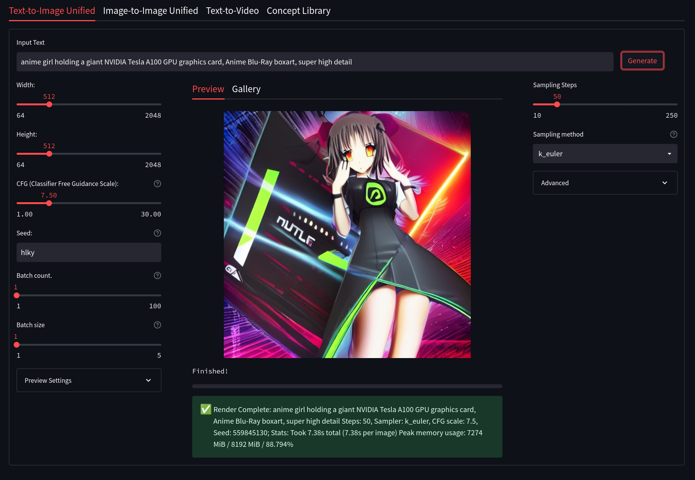

# <center>Web-based UI for Stable Diffusion</center>

## Created by [sd-webui](https://github.com/sd-webui)

## [Visit sd-webui's Discord Server](https://discord.gg/gyXNe4NySY) [](https://discord.gg/gyXNe4NySY)

## Installation instructions for:

- **[Windows](https://sd-webui.github.io/stable-diffusion-webui/docs/1.windows-installation.html)** 
- **[Linux](https://sd-webui.github.io/stable-diffusion-webui/docs/2.linux-installation.html)**

### Want to ask a question or request a feature?

Come to our [Discord Server](https://discord.gg/gyXNe4NySY) or use [Discussions](https://github.com/sd-webui/stable-diffusion-webui/discussions).

## Documentation

[Documentation is located here](https://sd-webui.github.io/stable-diffusion-webui/)

## Want to contribute?

Check the [Contribution Guide](CONTRIBUTING.md)

[sd-webui](https://github.com/sd-webui) main devs:

*  [hlky](https://github.com/hlky)
* [ZeroCool940711](https://github.com/ZeroCool940711)
* [codedealer](https://github.com/codedealer)

### Project Features:

* Two great Web UI's to choose from: Streamlit or Gradio

* No more manually typing parameters, now all you have to do is write your prompt and adjust sliders

* Built-in image enhancers and upscalers, including GFPGAN and realESRGAN

* Run additional upscaling models on CPU to save VRAM

* Textual inversion 🔥: [info](https://textual-inversion.github.io/) - requires enabling, see [here](https://github.com/hlky/sd-enable-textual-inversion), script works as usual without it enabled

* Advanced img2img editor with Mask and crop capabilities

* Mask painting 🖌️: Powerful tool for re-generating only specific parts of an image you want to change (currently Gradio only)

* More diffusion samplers 🔥🔥: A great collection of samplers to use, including:
  
  - `k_euler` (Default)
  - `k_lms`
  - `k_euler_a`
  - `k_dpm_2`
  - `k_dpm_2_a`
  - `k_heun`
  - `PLMS`
  - `DDIM`

* Loopback ➿: Automatically feed the last generated sample back into img2img

* Prompt Weighting 🏋️: Adjust the strength of different terms in your prompt

* Selectable GPU usage with `--gpu <id>`

* Memory Monitoring 🔥: Shows VRAM usage and generation time after outputting

* Word Seeds 🔥: Use words instead of seed numbers

* CFG: Classifier free guidance scale, a feature for fine-tuning your output

* Automatic Launcher: Activate conda and run Stable Diffusion with a single command

* Lighter on VRAM: 512x512 Text2Image & Image2Image tested working on 4GB

* Prompt validation: If your prompt is too long, you will get a warning in the text output field

* Copy-paste generation parameters: A text output provides generation parameters in an easy to copy-paste form for easy sharing.

* Correct seeds for batches: If you use a seed of 1000 to generate two batches of two images each, four generated images will have seeds: `1000, 1001, 1002, 1003`.

* Prompt matrix: Separate multiple prompts using the `|` character, and the system will produce an image for every combination of them.

* Loopback for Image2Image: A checkbox for img2img allowing to automatically feed output image as input for the next batch. Equivalent to saving output image, and replacing input image with it.

# Stable Diffusion Web UI

A fully-integrated and easy way to work with Stable Diffusion right from a browser window.

## Streamlit



**Features:**

- Clean UI with an easy to use design, with support for widescreen displays.
- Dynamic live preview of your generations
- Easily customizable presets right from the WebUI (Coming Soon!)
- An integrated gallery to show the generations for a prompt or session (Coming soon!)
- Better optimization VRAM usage optimization, less errors for bigger generations.
- Text2Video - Generate video clips from text prompts right from the WEb UI (WIP)
- Concepts Library - Run custom embeddings others have made via textual inversion.
- Actively being developed with new features being added and planned - Stay Tuned!
- Streamlit is now the new primary UI for the project moving forward.
- *Currently in active development and still missing some of the features present in the Gradio Interface.*

Please see the [Streamlit Documentation](docs/4.streamlit-interface.md) to learn more.

## Gradio


**Features:**

- Older UI design that is fully functional and feature complete.
- Has access to all upscaling models, including LSDR.
- Dynamic prompt entry automatically changes your generation settings based on `--params` in a prompt.
- Includes quick and easy ways to send generations to Image2Image or the Image Lab for upscaling.
- *Note, the Gradio interface is no longer being actively developed and is only receiving bug fixes.*

Please see the [Gradio Documentation](docs/5.gradio-interface.md) to learn more.

## Image Upscalers

---

### GFPGAN


Lets you improve faces in pictures using the GFPGAN model. There is a checkbox in every tab to use GFPGAN at 100%, and also a separate tab that just allows you to use GFPGAN on any picture, with a slider that controls how strong the effect is.

If you want to use GFPGAN to improve generated faces, you need to install it separately.
Download [GFPGANv1.4.pth](https://github.com/TencentARC/GFPGAN/releases/download/v1.3.4/GFPGANv1.4.pth) and put it
into the `/stable-diffusion-webui/models/gfpgan` directory. 

### RealESRGAN


Lets you double the resolution of generated images. There is a checkbox in every tab to use RealESRGAN, and you can choose between the regular upscaler and the anime version.
There is also a separate tab for using RealESRGAN on any picture.

Download [RealESRGAN_x4plus.pth](https://github.com/xinntao/Real-ESRGAN/releases/download/v0.1.0/RealESRGAN_x4plus.pth) and [RealESRGAN_x4plus_anime_6B.pth](https://github.com/xinntao/Real-ESRGAN/releases/download/v0.2.2.4/RealESRGAN_x4plus_anime_6B.pth).
Put them into the `stable-diffusion-webui/models/realesrgan` directory. 


### LSDR

Download **LDSR** [project.yaml](https://heibox.uni-heidelberg.de/f/31a76b13ea27482981b4/?dl=1) and [model last.cpkt](https://heibox.uni-heidelberg.de/f/578df07c8fc04ffbadf3/?dl=1). Rename last.ckpt to model.ckpt and place both under `stable-diffusion-webui/models/ldsr/`

### GoBig, and GoLatent *(Currently on the Gradio version Only)*

More powerful upscalers that uses a seperate Latent Diffusion model to more cleanly upscale images.


Please see the [Image Enhancers Documentation](docs/5.image_enhancers.md) to learn more.

-----

### *Original Information From The Stable Diffusion Repo*

# Stable Diffusion

*Stable Diffusion was made possible thanks to a collaboration with [Stability AI](https://stability.ai/) and [Runway](https://runwayml.com/) and builds upon our previous work:*

[**High-Resolution Image Synthesis with Latent Diffusion Models**](https://ommer-lab.com/research/latent-diffusion-models/)<br/>
[Robin Rombach](https://github.com/rromb)\*,
[Andreas Blattmann](https://github.com/ablattmann)\*,
[Dominik Lorenz](https://github.com/qp-qp)\,
[Patrick Esser](https://github.com/pesser),
[Björn Ommer](https://hci.iwr.uni-heidelberg.de/Staff/bommer)<br/>

**CVPR '22 Oral**

which is available on [GitHub](https://github.com/CompVis/latent-diffusion). PDF at [arXiv](https://arxiv.org/abs/2112.10752). Please also visit our [Project page](https://ommer-lab.com/research/latent-diffusion-models/).

[Stable Diffusion](#stable-diffusion-v1) is a latent text-to-image diffusion
model.
Thanks to a generous compute donation from [Stability AI](https://stability.ai/) and support from [LAION](https://laion.ai/), we were able to train a Latent Diffusion Model on 512x512 images from a subset of the [LAION-5B](https://laion.ai/blog/laion-5b/) database. 
Similar to Google's [Imagen](https://arxiv.org/abs/2205.11487), 
this model uses a frozen CLIP ViT-L/14 text encoder to condition the model on text prompts.
With its 860M UNet and 123M text encoder, the model is relatively lightweight and runs on a GPU with at least 10GB VRAM.
See [this section](#stable-diffusion-v1) below and the [model card](https://huggingface.co/CompVis/stable-diffusion).

## Stable Diffusion v1

Stable Diffusion v1 refers to a specific configuration of the model
architecture that uses a downsampling-factor 8 autoencoder with an 860M UNet
and CLIP ViT-L/14 text encoder for the diffusion model. The model was pretrained on 256x256 images and 
then finetuned on 512x512 images.

*Note: Stable Diffusion v1 is a general text-to-image diffusion model and therefore mirrors biases and (mis-)conceptions that are present
in its training data. 
Details on the training procedure and data, as well as the intended use of the model can be found in the corresponding [model card](https://huggingface.co/CompVis/stable-diffusion).

## Comments

- Our codebase for the diffusion models builds heavily on [OpenAI's ADM codebase](https://github.com/openai/guided-diffusion)
  and [https://github.com/lucidrains/denoising-diffusion-pytorch](https://github.com/lucidrains/denoising-diffusion-pytorch). 
  Thanks for open-sourcing!

- The implementation of the transformer encoder is from [x-transformers](https://github.com/lucidrains/x-transformers) by [lucidrains](https://github.com/lucidrains?tab=repositories). 

## BibTeX

```
@misc{rombach2021highresolution,
      title={High-Resolution Image Synthesis with Latent Diffusion Models}, 
      author={Robin Rombach and Andreas Blattmann and Dominik Lorenz and Patrick Esser and Björn Ommer},
      year={2021},
      eprint={2112.10752},
      archivePrefix={arXiv},
      primaryClass={cs.CV}
}

```
