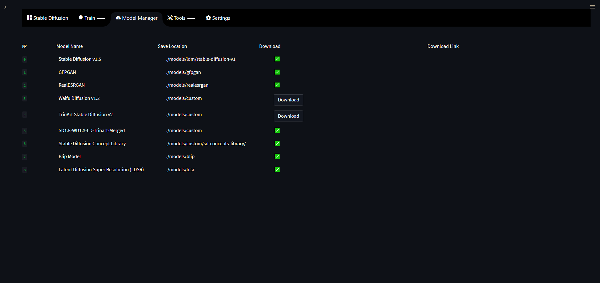

# Streamlit Web UI Interface

## Features:

- Clean and easy to use UI: A clean and simple UI with an easy to use design.

- Support for widescreen displays.

- Dynamic Image Preview: This allows you to see how your image is looking during the generation process in real time or near real time (no more waiting until the end to see your image).

- Stop Button: A stop button to stop your generation mid-way if you do not like how your result is looking based on the image preview.

- An integrated gallery to show the generations for a prompt or session (Coming soon!)

- Better optimization VRAM usage optimization, less errors for bigger generations.

- Ability to load and use almost any `ckpt` models or model from HuggingFace.

- Text2Video: Generate video clips from text prompts right from the Web UI thanks to Diffusion Walk.

- Concepts Library: Easy to browse and use textual inversion library of custom embeddings others people (or yourself) have made via textual inversion.

- Textual Inversion: Allow you to create your own embeddings from images and use them in the UI.

- Actively being developed with new features being added and planned - Stay Tuned!

- Streamlit is now the new primary UI for the project moving forward.

- *Currently in active development but still missing some of the features present in the Gradio Interface (Post-Processing tab).*

---

## Text To Image

Streamlit Text2Image allows for a modern, but well known, Stable Diffusion Textual Image generation experience. Here is a quick description of some of the features of Text2Image and what they do:

- Width and Height: Control the size of the generated image (Default is 512px)
- Classifier Free Guidance (CFG): How closely the final image should follow your prompt (Default is 7.5)
- Seed: The number (or word) used to generate an image with.
- Images Per Batch: The number of images to generate consecutively (Does not affect VRAM usage)
- Number of Batches: How many images to generate at once (Very VRAM Intensive)
- Sampling Steps: The quality of the final output, higher is better (Default is 30)
- Sampling Method: Which sampler to use to generate the image (Default is `k_euler`)

---

## Image To Image

Streamlit Image2Image allows for you to take an image, be it generated by Stable Diffusion or otherwise, and use it as a base for another generation. This has the potential to really enhance images and fix issues with initial Text2Image generations. It also includes some built-in drawing and masking tools to help create custom generations. Some notable features of Gradio Image2Image are:

- Image Editor Mode: Choose whether you wish to mask, crop, or uncrop the image
- Mask Mode: Allows you to decide if a drawn mask should be generated or kept
- Denoising Strength: How much of the generated image should replace the original image. (default is 75%)
- Width and Height: Control the size of the generated image (Default is 512px)
- Classifier Free Guidance (CFG): How closely the final image should follow your prompt (Default is 7.5)
- Seed: The number (or word) used to generate an image with
- Images Per Batch: The number of images to generate consecutively (Does not affect VRAM)
- Number of Batches: How many images to generate at once (Very VRAM Intensive)
- Sampling Steps: The quality of the final output, higher is better (Default is 30)
- Sampling Method: Which sampler to use to generate the image (Default is `k_euler`)

## Text To Video

---

The Text2Video tab allow you to generate videos based on a text prompt, it does so by using diffusion walk which generates images using txt2img and then interpolate them in order to walk between prompts or parts of a prompt. As of right now you can only use a single prompt which is then duplicated based on the number of seeds you use.

#### Options:

- Width: The width in pixels for your output image.

- Height: The height in pixels for your output image.

- CFG: How close you want clip to guide the generation toward your prompt.

- Seed: Seed to use during generation, can be an integer, a word or several integers and words separated by comma. When multiple seeds are used the resulting video might be more consistent than when using a single seed.

- Max Duration in Seconds: How long your video should be in seconds.

- Custom Model: A list of models from the HuggingFace website to use, any model hosted on HuggingFace can be used for txt2vid. To add a new model to this list you need to edit the config file on `configs/webui/userconfig_streamlit.yaml`, find the `txt2vid` section and add your model under `custom_models_list`, use other models there for reference on how the format should looks like.

- Sampling Steps: How many steps to perform on an image, this can be seen as the amount of denoising steps performed on the image, higher values mean you get an image with less noise, it also affects the amount of repetition on the image you will get. For higher resolutions with short prompts and long prompts with low resolution you need to increase the number of samplings steps to get a better result, otherwise the amount of repetition on the image will increase exponentially if you use a lower sampling steps value.

- Inference Steps: Extra denoising steps performed between frames/images. This helps make the video more consistent and jump less around, higher values are always better but will make it so the video takes longer for generate.

- Scheduler: Scheduler to use for inference.

- Beta Schedule Type: Scheduler type to use.

## SD Concepts Library

---

The Concept Library allows for the easy usage of custom textual inversion models. These models may be loaded into `models/custom/sd-concepts-library` and will appear in the Concepts Library in Streamlit. To use one of these custom models in a prompt, either copy it using the button on the model, or type `<model-name>` in the prompt where you wish to use it.

Please see the [Concepts Library](https://github.com/Sygil-Dev/sygil-webui/blob/master/docs/7.concepts-library.md) section to learn more about how to use these tools.

## Textual Inversion

---

Textual Inversion allows you to create your own embed files training the model in a few images to teach it a new concept based on what is already in the original model, this is fast and do not need too many resources to do so. You can train a new concept to use on the Concepts Library with Textual Inversion, once you finish training it you can then use it on the concepts library.

## Model Manager

---

The Model Manager page allows you to download models with the click of a button, instead of having to go and manually find the link to download a model and then finding where to put it on your disk for the app to detect it we made it so the Model Manager page does most of the heavy lifting for you.

## Tools

This section is a work in progress.

The idea behind it is to provide extra tools for advanced users to do things they need that are not possible with other normal pages. This is intended mainly for developers or technical people wanting to do more than just basic stuff with the UI and even integrating their own things into it.

## Settings

---

The Settings page allows you to customize how you want Streamlit to run. These changes will be saved to a personalized user setting file in `configs/webui/userconfig_streamlit.yaml`, this file is independent from the defaults file located in `configs/webui/webui_streamlit.yaml` and will not be reset after updates unless a mayor change that would break some options is released, in which case this file will be reset to the defaults values and you would need to configure your settings on the Settings page again. After editing the settings on the Settings page you need to scroll down and hit the `Save` button for it to take effect, you can also use the `Reset` button to reset your settings manually to the defaults in case you made a mistake with any of your settings and you need to reset them, so, feel free to experiment with them and test which settings work best for you and which don't.
