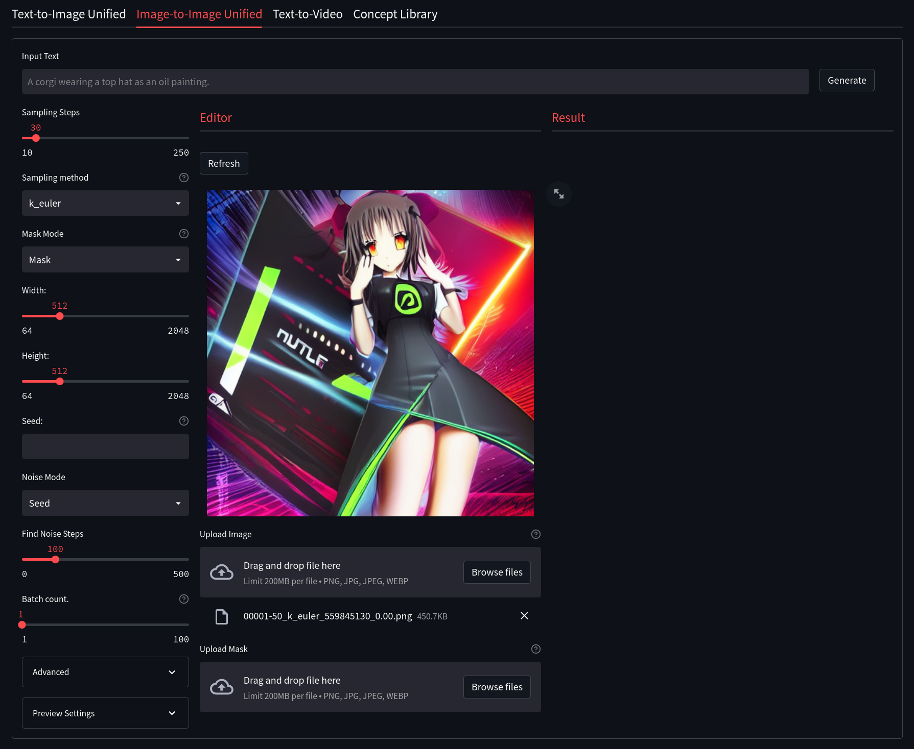
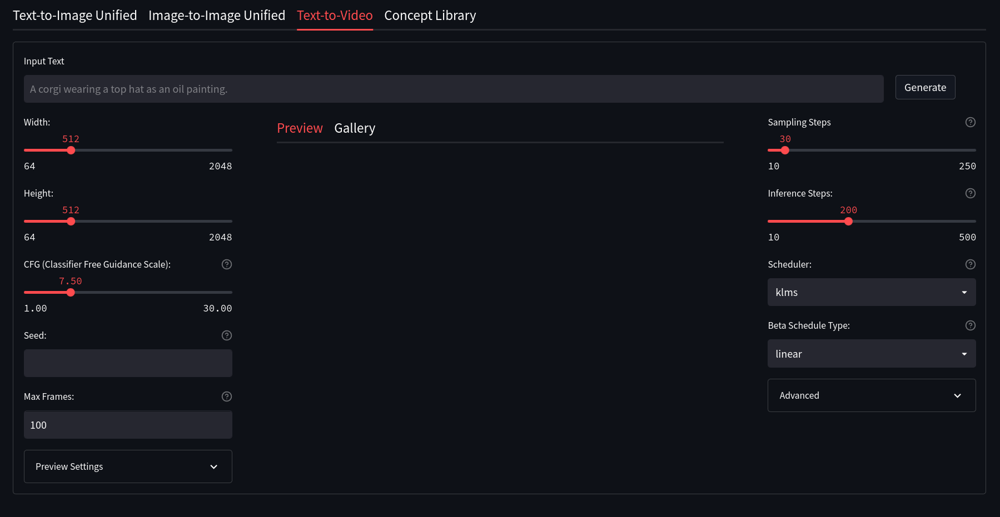
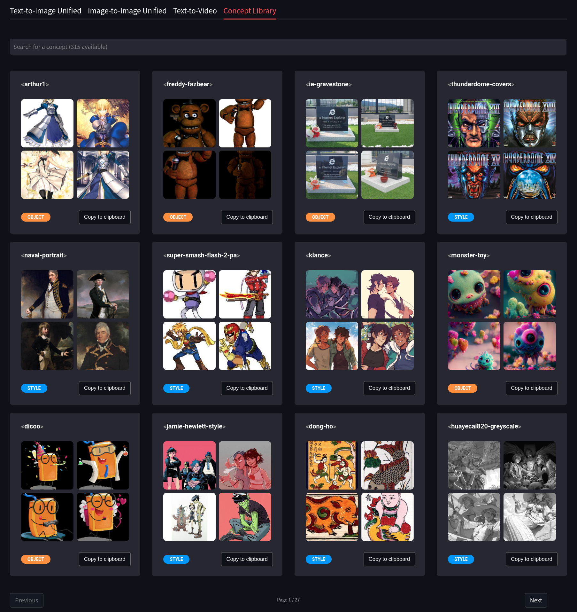

<!--
This file is part of stable-diffusion-webui (https://github.com/sd-webui/stable-diffusion-webui/).

Copyright 2022 sd-webui team.
This program is free software: you can redistribute it and/or modify
it under the terms of the GNU Affero General Public License as published by
the Free Software Foundation, either version 3 of the License, or
(at your option) any later version.

This program is distributed in the hope that it will be useful,
but WITHOUT ANY WARRANTY; without even the implied warranty of
MERCHANTABILITY or FITNESS FOR A PARTICULAR PURPOSE.  See the
GNU Affero General Public License for more details.

You should have received a copy of the GNU Affero General Public License
along with this program.  If not, see <http://www.gnu.org/licenses/>.
-->

**Features:**
- Clean UI with an easy to use design, with support for widescreen displays.
- Dynamic live preview of your generations
- Easily customizable presets right from the WebUI (Coming Soon!)
- An integrated gallery to show the generations for a prompt or session (Coming soon!)
- Better optimization VRAM usage optimization, less errors for bigger generations.
- Text2Video - Generate video clips from text prompts right from the WEb UI (WIP)
- Concepts Library - Run custom embeddings others have made via textual inversion.
- Actively being developed with new features being added and planned - Stay Tuned!
- Streamlit is now the new primary UI for the project moving forward.
- *Currently in active development and still missing some of the features present in the Gradio Interface.*

### Launching The Streamlit Web UI

To launch the Streamlit Web UI, you will need to do the following:

- Windows:
    - Open your command line in the repo folder and run the `webui_streamlit.cmd` file.
- Linux:
    - Open your terminal to the repo folder and run `webui.sh`, then press `1` when prompted.
- Manually:
    - Open your terminal to the repo folder.
    - Activate the conda environment using `conda activate ldm`
    - Run the command `python -m streamlit run scripts/webui_streamlit.py`

Once the Streamlit Web UI launches, a new browser tab will open with the interface. A link will also appear in your terminal to allow you to copy and paste it as needed.

## Text2Image
---

Streamlit Text2Image allows for a modern, but well known, Stable Diffusion Textual Image generation experience. Here is a quick description of some of the features of Text2Image and what they do:

- Width and Height: Control the size of the generated image (Default is 512px)
- Classifer Free Guidance (CFG): How closely the final image should follow your prompt (Default is 7.5)
- Seed: The number (or word) used to generate an image with
- Images Per Batch: The number of images to generate consecutively (Does not affect VRAM)
- Number of Batches: How many images to generate at once (Very VRAM Intensive)
- Sampling Steps: The quality of the final output, higher is better with dimiishing returns (Default is 30)
- Sampling Method: Which sampler to use to generate the image (Default is `k_euler`)

## Image2Image
--

Streamlit Image2Image allows for you to take an image, be it generated by Stable Diffusion or otherwise, and use it as a base for another geenration. This has the potential to really enhance images and fix issues with initial Text2Image generations. It also includes some built-in drawing and masking tools to help create custom generations. Some notable features of Gradio Image2Image are:

- Image Editor Mode: Choose whether you wish to mask, crop, or uncrop the image
- Mask Mode: Alloows you to decide if a drawn mask should be generated or kept
- Denoising Strength: How much of the generated image should replace the original image. (default is 75%)
- Width and Height: Control the size of the generated image (Default is 512px)
- Classifer Free Guidance (CFG): How closely the final image should follow your prompt (Default is 7.5)
- Seed: The number (or word) used to generate an image with
- Images Per Batch: The number of images to generate consecutively (Does not affect VRAM)
- Number of Batches: How many images to generate at once (Very VRAM Intensive)
- Sampling Steps: The quality of the final output, higher is better with dimiishing returns (Default is 30)
- Sampling Method: Which sampler to use to generate the image (Default is `k_euler`)

## Text2Video
---

*Insert details of how to use T2V here*
(ZeroCool neds to fill in details here of how Text2Video works)

## SD Concepts Library
---

The Concept Library allows for the easy usage of custom textual inversion models. These models may be loaded into `models/custom/sd-concepts-library` and will appear in the Concepts Library in Streamlit. To use one of these custom models in a prompt, either copy it using the button on the model, or type `<model-name>` in the prompt where you wish to use it.

Please see the [Concepts Library](https://github.com/sd-webui/stable-diffusion-webui/blob/master/docs/7.concepts-library.md) section to learn more about how to use these tools.

## Textual Inversion
---

TBD

## Model Manager
---

TBD

## Settings
---

*This section of the Web UI is still in development*

This area allows you to custmoize how you want Streamlit to run. These changes will be saved to `configs/webui/userconfig_streamlit.yaml`. 
