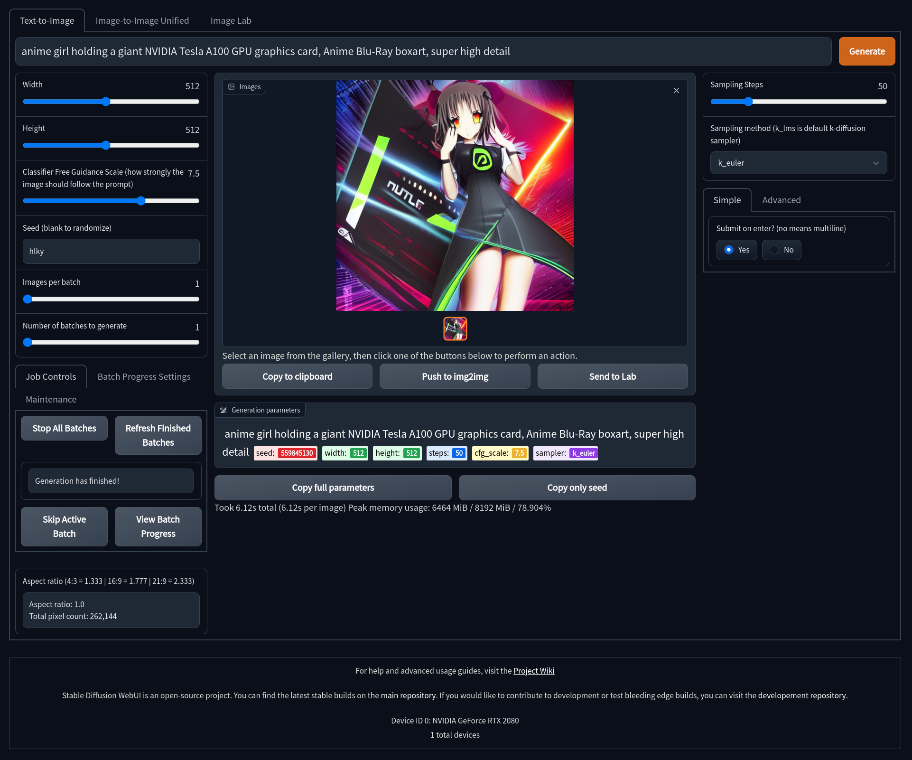
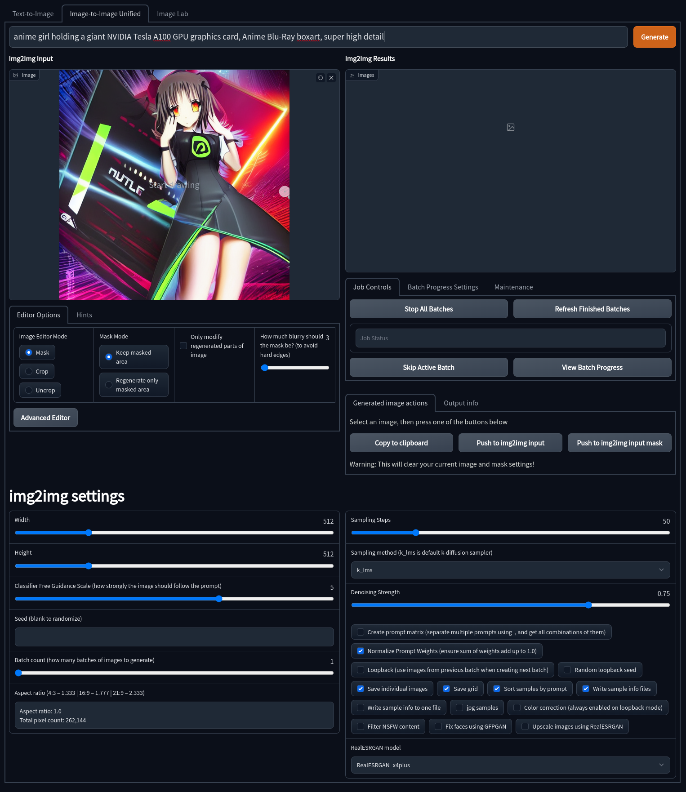
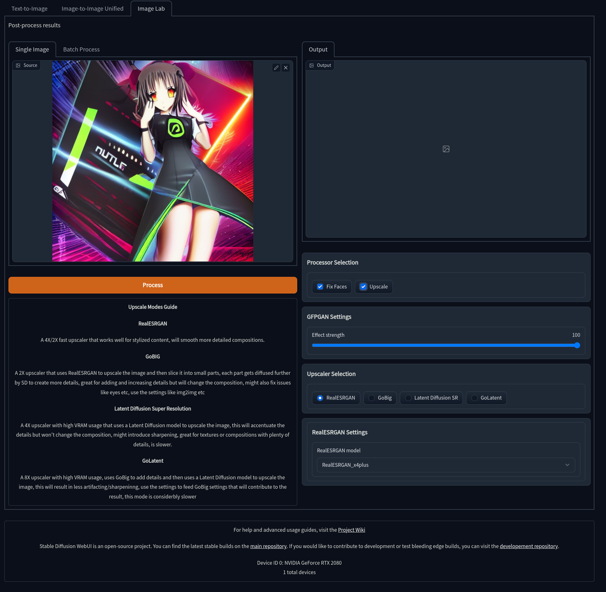
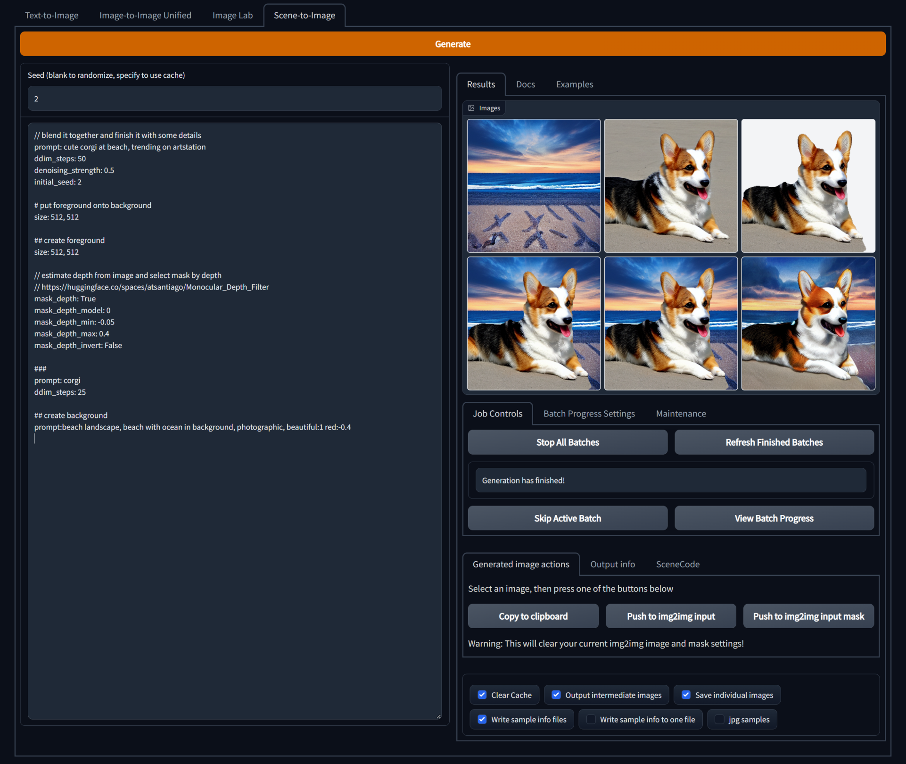

<!--
This file is part of stable-diffusion-webui (https://github.com/sd-webui/stable-diffusion-webui/).

Copyright 2022 sd-webui team.
This program is free software: you can redistribute it and/or modify
it under the terms of the GNU Affero General Public License as published by
the Free Software Foundation, either version 3 of the License, or
(at your option) any later version.

This program is distributed in the hope that it will be useful,
but WITHOUT ANY WARRANTY; without even the implied warranty of
MERCHANTABILITY or FITNESS FOR A PARTICULAR PURPOSE.  See the
GNU Affero General Public License for more details.

You should have received a copy of the GNU Affero General Public License
along with this program.  If not, see <http://www.gnu.org/licenses/>.
-->

### Gradio Web UI Features:
- Older UI design that is fully functional and feature complete.
- Has access to all upscaling models, including LSDR.
- Dynamic prompt entry automatically changes your generation settings based on `--params` in a prompt.
- Includes quick and easy ways to send generations to Image2Image or the Image Lab for upscaling.
- *Note, the Gradio interface is no longer being actively developed and is only receiving bug fixes.*

### Launching The Gradio Web UI

To launch the Gradio Web UI, you will need to do the following:

- Windows:
    - Open your command line in the repo folder and run the `webui.cmd` file.
- Linux:
    - Open your terminal to the repo folder and run `webui.sh`, then press `2` when prompted.
- Manually:
    - Open your terminal to the repo folder.
    - Activate the conda environment using `conda activate ldm`
    - Run the command `python scripts/relauncher.py`

Once the Gradio Web UI launches, a link will appear in your command line or terminal, click or copy and paste that link into your browser to access the interface.

## Text2Image
---



Gradio Text2Image allows for the classic and well known Stable Diffusion Textual Image generation. Here is a quick description of some of the features of Text2Image and what they do:

- Width and Height: Control the size of the generated image (Default is 512px)
- Classifer Free Guidance (CFG): How closely the final image should follow your prompt (Default is 7.5)
- Seed: The number (or word) used to generate an image with
- Images Per Batch: The number of images to generate consecutively (Does not affect VRAM)
- Number of Batches: How many images to generate at once (Very VRAM Intensive)
- Sampling Steps: The quality of the final output, higher is better with dimiishing returns (Default is 50)
- Sampling Method: Which sampler to use to generate the image (Default is `k_lms`)
- Push to Img2Img: Send the image to the Image2Image tool to continue working with it via Stable Diffusion
- Send to Image Lab: Send the image to the Image Lab for Enhancement and Upscaling.

## Image2Image
---



Gradio Image2Image allows for you to take an image, be it generated by Stable Diffusion or otherwise, and use it as a base for another geenration. This has the potential to really enhance images and fix issues with initial Text2Image generations. It also includes some built-in drawing and masking tools to help create custom generations. Some notable features of Gradio Image2Image are:

- Image Editor Mode: Choose whether you wish to mask, crop, or uncrop the image
- Mask Mode: Alloows you to decide if a drawn mask should be generated or kept
- Denoising Strength: How much of the generated image should replace the original image. (default is 70%)
- Width and Height: Control the size of the generated image (Default is 512px)
- Classifer Free Guidance (CFG): How closely the final image should follow your prompt (Default is 7.5)
- Seed: The number (or word) used to generate an image with
- Images Per Batch: The number of images to generate consecutively (Does not affect VRAM)
- Number of Batches: How many images to generate at once (Very VRAM Intensive)
- Sampling Steps: The quality of the final output, higher is better with dimiishing returns (Default is 50)
- Sampling Method: Which sampler to use to generate the image (Default is `k_lms`)

## Image Lab
---



The Gradio Image Lab is a central location to access image enhancers and upscalers. Though some options are available in all tabs (GFPGAN and realESRGAN), the Image Lab is where all of these tools may be easily accessed. These upscalers can be used for geenrated images sent to the lab, or on other images uploaded to it. The tools included here are:

- GFPGAN: Fixes and enhances faces
- realESRGAN: A 4x upscaler that uses a GAN to achieve its results
- GoBig: A 2x upsclaer that uses realESRGAN, but preserves more detail
- LSDR: A 4x upsclaer that uses Latent Diffusion, preserving a lot more detail at the cost of speed and VRAM
- GoLatent: Uses LSDR to do a 4x upscale, then GoBig to make a final 8x upscale with great detail preservation.

Please see the [Image Enhancers](6.image_enhancers.md) section to learn more about how to use these tools.


## Scene2Image
---



Gradio Scene2Image allows you to define layers of images in a markdown-like syntax.

> Would it be possible to have a layers system where we could do have
foreground, mid, and background objects which relate to one another and
share the style? So we could say generate a landscape, one another layer
generate a castle, and on another layer generate a crowd of people.

You write a a multi-line prompt that looks like markdown, where each section declares one layer.
It is hierarchical, so each layer can have their own child layers.
In the frontend you can find a brief documentation for the syntax, examples and reference for the various arguments.
Here a summary:

Markdown headings, e.g. '# layer0', define layers. 
The content of sections define the arguments for image generation. 
Arguments are defined by lines of the form 'arg:value' or 'arg=value'.

Layers are hierarchical, i.e. each layer can contain more layers. 
The number of '#' increases in the headings of a child layers.
Child layers are blended together by their image masks, like layers in image editors.
By default alpha composition is used for blending. 
Other blend modes from [ImageChops](https://pillow.readthedocs.io/en/stable/reference/ImageChops.html) can also be used.

Sections with "prompt" and child layers invoke Image2Image, without child layers they invoke Text2Image. 
The result of blending child layers will be the input for Image2Image.

Without "prompt" they are just images, useful for mask selection, image composition, etc.
Images can be initialized with "color", resized with "resize" and their position specified with "pos".
Rotation and rotation center are "rotation" and "center". 

Mask can automatically be selected by color, color at pixels of the image, or by estimated depth.

You can chose between two different depth estimation models, see frontend reference for name of arguments.
[Monocular depth estimation](https://huggingface.co/spaces/atsantiago/Monocular_Depth_Filter) can be selected as depth model `0`.
[MiDaS depth estimation](https://huggingface.co/spaces/pytorch/MiDaS), used by default, can be selected as depth model `1`.

Depth estimation can be used for traditional 3d reconstruction.
Using `transform3d=True` the pixels of an image can be rendered from another perspective or with a different field of view.
For this you specify pose and field of view that corresponds to the input image and a desired output pose and field of view.
The poses describe the camera position and orientation as x,y,z,rotate_x,rotate_y,rotate_z tuple with angles describing rotations around axes in degrees.
The camera coordinate system is the pinhole camera as described and pictured in [OpenCV "Camera Calibration and 3D Reconstruction" documentation](https://docs.opencv.org/4.x/d9/d0c/group__calib3d.html).

When the camera pose `transform3d_from_pose` where the input image was taken is not specified, the camera pose `transform3d_to_pose` to which the image is to be transformed is in terms of the input camera coordinate system:
Walking forwards one depth unit in the input image corresponds to a position `0,0,1`. 
Walking to the right is something like `1,0,0`. 
Going downwards is then `0,1,0`.


## Gradio Optional Customizations
---

Gradio allows for a number of possible customizations via command line arguments/terminal parameters. If you are running these manually, they would need to be run like this: `python scripts/webui.py --param`. Otherwise, you may add your own parameter customizations to `scripts/relauncher.py`, the program that automatically relaunches the Gradio interface should a crash happen. 

Inside of `relauncher.py` are a few preset defaults most people would likely access:

```
# Run upscaling models on the CPU
extra_models_cpu = False

# Automatically open a new browser window or tab on first launch
open_in_browser = False

# Run Stable Diffusion in Optimized Mode - Only requires 4Gb of VRAM, but is significantly slower
optimized = False

# Run in Optimized Turbo Mode - Needs more VRAM than regular optimized mode, but is faster
optimized_turbo = False

# Creates a public xxxxx.gradio.app share link to allow others to use your interface (requires properly forwarded ports to work correctly)
share = False

# Generate tiling images
tiling = False
```
Setting any of these to `True` will enable those parameters on every launch. Alternatively, if you wish to enable a `--parameter` not listed here, you can enter your own custom ones in this field inside of `scripts/relauncher.py`:

```
# Enter other `--arguments` you wish to use - Must be entered as a `--argument ` syntax
additional_arguments = ""
```

## List of command line options
---

This is a list of the full set of optional parameters you can launch the Gradio Interface with. 

```
usage: webui.py [-h] [--ckpt CKPT] [--cli CLI] [--config CONFIG] [--defaults DEFAULTS] [--esrgan-cpu] [--esrgan-gpu ESRGAN_GPU] [--extra-models-cpu] [--extra-models-gpu] [--gfpgan-cpu] [--gfpgan-dir GFPGAN_DIR] [--gfpgan-gpu GFPGAN_GPU] [--gpu GPU]
                [--grid-format GRID_FORMAT] [--inbrowser] [--ldsr-dir LDSR_DIR] [--n_rows N_ROWS] [--no-half] [--no-progressbar-hiding] [--no-verify-input] [--optimized-turbo] [--optimized] [--outdir_img2img [OUTDIR_IMG2IMG]] [--outdir_imglab [OUTDIR_IMGLAB]]
                [--outdir_txt2img [OUTDIR_TXT2IMG]] [--outdir [OUTDIR]] [--filename_format [FILENAME_FORMAT]] [--port PORT] [--precision {full,autocast}] [--realesrgan-dir REALESRGAN_DIR] [--realesrgan-model REALESRGAN_MODEL] [--save-metadata]
                [--share-password SHARE_PASSWORD] [--share] [--skip-grid] [--skip-save] [--no-job-manager] [--max-jobs MAX_JOBS] [--tiling]

optional arguments:
  -h, --help            show this help message and exit
  --ckpt CKPT           path to checkpoint of model (default: models/ldm/stable-diffusion-v1/model.ckpt)
  --cli CLI             don't launch web server, take Python function kwargs from this file. (default: None)
  --config CONFIG       path to config which constructs model (default: configs/stable-diffusion/v1-inference.yaml)
  --defaults DEFAULTS   path to configuration file providing UI defaults, uses same format as cli parameter (default: configs/webui/webui.yaml)
  --esrgan-cpu          run ESRGAN on cpu (default: False)
  --esrgan-gpu ESRGAN_GPU
                        run ESRGAN on specific gpu (overrides --gpu) (default: 0)
  --extra-models-cpu    run extra models (GFGPAN/ESRGAN) on cpu (default: False)
  --extra-models-gpu    run extra models (GFGPAN/ESRGAN) on gpu (default: False)
  --gfpgan-cpu          run GFPGAN on cpu (default: False)
  --gfpgan-dir GFPGAN_DIR
                        GFPGAN directory (default: ./GFPGAN)
  --gfpgan-gpu GFPGAN_GPU
                        run GFPGAN on specific gpu (overrides --gpu) (default: 0)
  --gpu GPU             choose which GPU to use if you have multiple (default: 0)
  --grid-format GRID_FORMAT
                        png for lossless png files; jpg:quality for lossy jpeg; webp:quality for lossy webp, or webp:-compression for lossless webp (default: jpg:95)
  --inbrowser           automatically launch the interface in a new tab on the default browser (default: False)
  --ldsr-dir LDSR_DIR   LDSR directory (default: ./LDSR)
  --n_rows N_ROWS       rows in the grid; use -1 for autodetect and 0 for n_rows to be same as batch_size (default: -1) (default: -1)
  --no-half             do not switch the model to 16-bit floats (default: False)
  --no-progressbar-hiding
                        do not hide progressbar in gradio UI (we hide it because it slows down ML if you have hardware accleration in browser) (default: False)
  --no-verify-input     do not verify input to check if it's too long (default: False)
  --optimized-turbo     alternative optimization mode that does not save as much VRAM but runs siginificantly faster (default: False)
  --optimized           load the model onto the device piecemeal instead of all at once to reduce VRAM usage at the cost of performance (default: False)
  --outdir_img2img [OUTDIR_IMG2IMG]
                        dir to write img2img results to (overrides --outdir) (default: None)
  --outdir_imglab [OUTDIR_IMGLAB]
                        dir to write imglab results to (overrides --outdir) (default: None)
  --outdir_txt2img [OUTDIR_TXT2IMG]
                        dir to write txt2img results to (overrides --outdir) (default: None)
  --outdir [OUTDIR]     dir to write results to (default: None)
  --filename_format [FILENAME_FORMAT]
                        filenames format (default: None)
  --port PORT           choose the port for the gradio webserver to use (default: 7860)
  --precision {full,autocast}
                        evaluate at this precision (default: autocast)
  --realesrgan-dir REALESRGAN_DIR
                        RealESRGAN directory (default: ./RealESRGAN)
  --realesrgan-model REALESRGAN_MODEL
                        Upscaling model for RealESRGAN (default: RealESRGAN_x4plus)
  --save-metadata       Store generation parameters in the output png. Drop saved png into Image Lab to read parameters (default: False)
  --share-password SHARE_PASSWORD
                        Sharing is open by default, use this to set a password. Username: webui (default: None)
  --share               Should share your server on gradio.app, this allows you to use the UI from your mobile app (default: False)
  --skip-grid           do not save a grid, only individual samples. Helpful when evaluating lots of samples (default: False)
  --skip-save           do not save indiviual samples. For speed measurements. (default: False)
  --no-job-manager      Don't use the experimental job manager on top of gradio (default: False)
  --max-jobs MAX_JOBS   Maximum number of concurrent 'generate' commands (default: 1)
  --tiling              Generate tiling images (default: False)

```
